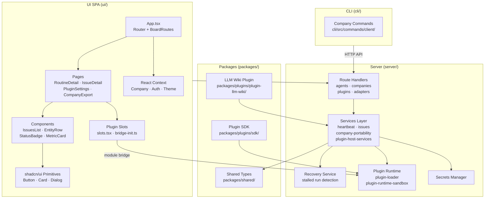

# Paperclip — Architecture

> Generated from the GitNexus knowledge graph: **46,037 symbols · 71,375 relationships · 300 execution flows · 1,871 files**

---

## Overview

Paperclip is an **AI agent control plane** — a platform for defining, running, and monitoring autonomous agents against issues and projects. It is organized as a **monorepo** with four primary layers:

| Layer              | Path          | Purpose                                                         |
| ------------------ | ------------- | --------------------------------------------------------------- |
| **Server**   | `server/`   | Node.js API — route handlers, business services, agent runtime |
| **UI**       | `ui/`       | React 19 SPA — control plane dashboard                         |
| **CLI**      | `cli/`      | Command-line client for company/export operations               |
| **Packages** | `packages/` | Shared types, plugin SDK, and built-in plugins                  |

The system is designed around **company-scoped workspaces**. Every entity (agent, issue, project, routine) belongs to a company, and all routing — both HTTP and client-side — is prefixed with a company slug.

---

## Functional Areas

Ranked by symbol count and cohesion score:

| Cluster              | Symbols | Cohesion | Role                                                                                       |
| -------------------- | ------- | -------- | ------------------------------------------------------------------------------------------ |
| **Services**   | 1,067   | 85%      | Core business logic — heartbeat engine, issues, plugin host, recovery, portability        |
| **Components** | 529     | 63%      | Reusable React components — IssuesList, EntityRow, StatusBadge, etc.                      |
| **Pages**      | 495     | 62%      | Page-level views — RoutineDetail, ExecutionWorkspaceDetail, CompanyExport, PluginSettings |
| **Server**     | 289     | 73%      | Server infrastructure — middleware, DB, session, app bootstrap                            |
| **Stories**    | 236     | 70%      | Storybook component stories for design system validation                                   |
| **Ui**         | 201     | 83%      | shadcn/ui primitives — Button, Card, Dialog, Input, Badge                                 |
| **Routes**     | 147     | 79%      | HTTP route handlers — agents, companies, plugins, adapters                                |
| **Scripts**    | 135     | 77%      | Build, migration, and utility scripts                                                      |
| **Wiki**       | 109     | 57%      | LLM wiki plugin — resolves and reconciles wiki project resources                          |
| **Adapters**   | 67      | 77%      | Integration adapters for external services                                                 |
| **Recovery**   | 64      | 74%      | Run recovery service — detects and repairs stalled/failed executions                      |
| **Commands**   | 56      | 78%      | Server-side command handlers                                                               |
| **Client**     | 54      | 82%      | CLI client commands — company export, import, management                                  |
| **Secrets**    | 44      | 86%      | Secret management layer                                                                    |
| **Plugins**    | 34      | 76%      | UI plugin slot system — bridge, module loader, slot mounts                                |
| **Context**    | 32      | 80%      | React context providers                                                                    |
| **Config**     | 19      | 97%      | Static configuration (highest cohesion — tightest module)                                 |

---

## Key Execution Flows

### 1. Agent Run Execution (`heartbeat.ts`)

The core of the platform. A single massive service orchestrates the full agent lifecycle.

```
executeRun
  └── claimQueuedRun          — atomically claim a queued run from the pool
        └── allowsIssueInteractionWake  — check if issue interaction can wake agent
              └── deriveCommentId       — compute the comment ID for the wake signal
                    └── extractWakeCommentIds  — extract all wake comment references
                          └── readNonEmptyString — validate string fields
```

Key symbols: `executeRun`, `claimQueuedRun`, `cancelRunInternal`, `parseHeartbeatPolicy`, `normalizeMaxConcurrentRuns`
Files: `server/src/services/heartbeat.ts`

---

### 2. Issue Management & Filtering (`IssuesList`)

Cross-community flow spanning Storybook stories → UI components → filter library.

```
IssueManagementStories (storybook)
  └── IssuesList
        └── getInitialWorkspaceViewState
              └── getInitialViewState
                    └── getViewState
                          └── normalizeIssueFilterState
                                └── normalizeIssueFilterValueArray
```

Files: `ui/storybook/stories/issue-management.stories.tsx`, `ui/src/components/IssuesList.tsx`, `ui/src/lib/issue-filters.ts`

---

### 3. Company-Scoped Routing (`boardRoutes`)

All navigation flows through company prefix resolution.

```
BoardRoutes (App.tsx)
  └── UseCompany               — resolve current company from context
        └── NormalizeCompanyPrefix   — strip/apply company slug to paths
              └── ParseIssuePathIdFromPath — extract issue ID from URL
```

Files: `ui/src/App.tsx`, `ui/src/lib/router.tsx`, `ui/src/lib/company-routes.ts`

---

### 4. Plugin Module Loading (dual-sided)

Plugins execute server-side in a sandbox and mount client-side via slots.

```
PluginSettings (page)
  └── usePluginSlots
        └── usePluginModuleLoader
              └── ensurePluginModulesLoaded
                    └── loadPluginModule
                          └── buildPluginModuleKey
```

**Server side:** `plugin-loader.ts` → `plugin-runtime-sandbox.ts` (sandboxed Node VM)
**Client side:** `ui/src/plugins/slots.tsx` → `bridge-init.ts` (PluginBridgeRegistry)
Files: `server/src/services/plugin-loader.ts`, `server/src/services/plugin-runtime-sandbox.ts`, `ui/src/plugins/slots.tsx`

---

### 5. Company Portability (Export/Import)

Full company data bundle — agents, projects, tasks, issues.

```
ImportBundle
  └── buildPreview             — assemble a preview of the import diff
        └── collectSelectedExportSlugs
              └── discoveredProjectPaths
                    └── NormalizePortablePath
```

Files: `server/src/services/company-portability.ts`, `ui/src/pages/CompanyExport.tsx`, `cli/src/commands/client/company.ts`

---

## Architecture Diagram



---

## Package Structure

```
paperclip/
├── server/
│   ├── src/
│   │   ├── routes/          # HTTP handlers: agents.ts, companies.ts, plugins.ts
│   │   └── services/        # Business logic: heartbeat.ts, issues.ts, recovery/
├── ui/
│   ├── src/
│   │   ├── App.tsx          # Router root, boardRoutes
│   │   ├── components/      # Reusable composites
│   │   ├── pages/           # Full page views
│   │   ├── plugins/         # slots.tsx, bridge-init.ts
│   │   ├── lib/             # router.tsx, company-routes.ts, issue-filters.ts
│   │   └── components/ui/   # shadcn primitives
│   └── storybook/           # Component stories
├── cli/
│   └── src/commands/client/ # company export/import commands
└── packages/
    ├── shared/src/types/     # Cross-cutting types (cost, issues, etc.)
    ├── plugins/sdk/          # Plugin SDK: types.ts, testing.ts, worker-rpc-host.ts
    └── plugins/plugin-llm-wiki/  # Built-in wiki plugin
```

---

## Key Design Patterns

### Company-Scoped Everything

All routes, contexts, and navigations resolve through `applyCompanyPrefix` / `normalizeCompanyPrefix`. No entity exists outside a company scope.

### Heartbeat-Driven Agent Execution

Agents do not push — the server **claims** runs via a heartbeat poll loop (`claimQueuedRun`). This prevents double-execution and enables graceful recovery.

### Dual-Sided Plugin Architecture

- **Server:** Plugins load in a sandboxed Node VM (`plugin-runtime-sandbox.ts`), communicate via RPC (`worker-rpc-host.ts`), and surface capabilities through `plugin-host-services.ts`
- **Client:** The `PluginBridgeRegistry` maps slot names to dynamically loaded plugin UI modules (`slots.tsx`)

### Recovery Service

`server/src/services/recovery/service.ts` runs independently, detecting stalled executions via `hasActiveExecutionPath` and `hasActiveRunForIssueId`, then re-queuing or cancelling as needed.
